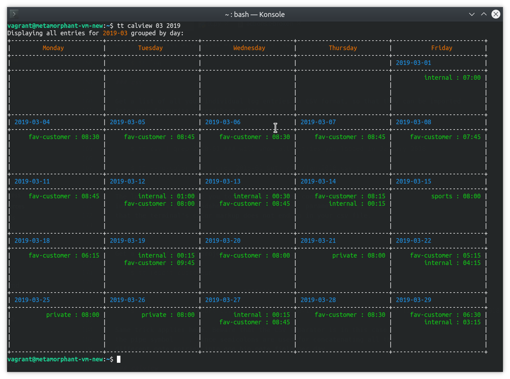

tt - A command-line based time tracker
===========

`tt` is a small stateful command line time tracking application
implemented in Python. Simple basic usage looks like this:

    $ tt start my-project 14:15
    $ tt stop 18:00

Alternatively you can skip the colon when entering times:

    $ tt start my-project 0915
    $ tt stop 1020

What is tt?
===========

`tt` is a simple command line time tracker. It is based on
[ti](https://github.com/tbekolay/ti), by Shrikant Sharat and Trevor
Bekolay and is written in Python. `ti` is in turn inspired by both
[timed](http://adeel.github.com/timed), and the elegantly simple
[t](http://stevelosh.com/projects/t/).

As opposed to its predecessor `ti`, `tt` is mostly aimed at cli versed IT
consultants or other professionals who need to *precisely* keep track of
their time spent working on multiple projects and issue customer
invoices based on their entries.

Logical structure
---------------

`tt` is made up of two main logical modules:
 
 - the actual time tracking module, that handles creation and editing of time entries (the C and U in **C**R**U**D).
 - the reporting module, which handles the evaluation of already entered time information (the R in C**R**UD).

Time boxes
----------
`tt` enables the user to record their effort in the form of *time segments* or *time boxes*.

A *time box* is defined by:
 - a name
 - a starting point
 - an end point
 - optional notes

    $ tt start my-project 14:15
    $ tt note 'Twas an extremely difficult call we had this afternoon'
    $ tt stop 18:00

Stateful time box definition
----------------------------

Another, somewhat hidden dimension is the *current date* - or day -
which is *implicitly* **today**, your machine's current `date`, unless
explicitly overriden by using the environment variable `TT_CURRENT_DAY`:

    $ export TT_CURRENT_DAY="2023-08-30" 
    # note the ISO formatting
    # any tt commands issued in between here and the unset command 
    # will refer to the 30th of August 2023

    $ tt start future-task 00:00
    $ tt note "Hoverboarding isn't what it used to be"
    $ tt note "Also, I'm probably sleeping right now"
    $ tt stop 07:00

    $ unset TT_CURRENT_DAY

Statefulness++ for your convenience
-----------------------------------

In addition to the implied *current date*, `tt` saves the outcome of any
successful command you've issued in a centralised JSON file. This means
that there is *only one state* of `tt` for your entire user session. You
can start a time box in one terminal window, add notes to it in another
one and finalise the time box in a third terminal.

The location of the time entry database can be specified via the
environment variable `SHEET_FILE`. The default location is
`~/.tt-sheet.json`.

To make your custom DB location persistent, just add the following line
to your `~/.bashrc` as demonstrated here:

    export SHEET_FILE=/home/johnson/timesheets/time-entries.json

Please consider backing up this file regularly, so as to avoid any
data loss.

To correct erroneous entries, you can either edit this file
directly or, alternately, use `tt`'s built-in `edit` function.

You can process the data from the time entry DB with any tool of your choosing.
`tt` provides you with some basic reporting that might or might
not make sense for your purpose.

Usage
=====

Adding a new time box:
---------------------
    $ tt start fav-customer 12:15
    Started working on fav-customer at 12:15.

    $ tt status
    You have been working on fav-customer for about 2 hours, since 12:15;
    It is now 14:12.

    $ tt stop 12:30
    So you stopped working on fav-customer.

`start` and `stop` can take a time argument of the form `HH:mm` or `HHmm` at
which to apply the action. They store the times normalized to GMT in the
database, taking into account the DST values for your timezone. 

Therefore beware when editing the timestamps in the DB file directly - this type of time 
arithmetic gets brainfucky really quickly and you *will* probably cock it up!

Enhance your time box with notes and tags:
-------------------------------------------

The **note** and **tag** commands only work if an active (open) time box
exists, i.e. if the `stop` command hasn't been invoked yet:

    $ tt note "implement new user authentication"

Tag your activity for added reportability:

    $ tt tag private

Change entries:
---------------

By setting a default text editor (console or gui-based) in the
environment variable `EDITOR`, you can easily correct mistakes. Just add
the following line, referencing your favourite text editor to your
`~/.bashrc` and enable fast time entry correction.

    $ export EDITOR=vim
    $ tt edit

This will open your time entry DB using the specified editor in the
handy YAML format. Once you save your changes and exit the file, the
changes will be persisted back into your SHEET\_FILE.

See your entries:
-----------------

### log

Get a log of all activities with the `log` (or `l`) command:

    $ tt log

### csv

Get a list of all your individual log entries in CSV format, so that they can be imported
into your favourite spreadsheet editor

    $ tt csv

    $ tt csv | grep 2018-01 ### will show all entries you logged in January 2018

    $ tt --no-color csv | grep 2018-01 &gt; /tmp/jan-2018.csv ;
    libreoffice /tmp/jan-2018.csv

The last command allows you to break out of the console and takes you
into the realm of spreadsheets. The `--no-color` parameter makes sure
that the terminal's color markup does not end up in your csv file.

### report

Get a report for your project, grouped and summed up by day:

    $ tt report customeur

    $ tt report customeur | grep 2018-10

    $ tt --no-color report customeur | grep 2018-10 > /tmp/oct-2018.csv ; libreoffice /tmp/oct-2018.csv

Same trick applies here. Beware that the CSV separator is in this case
the pipe symbol `|`, since semicolons are used for concatenating all the
different note entries into one big note field per day.

### calview

Doublecheck your entries per month and gain an overview of your effort
throughout the month. No more blindspots.

When calling calview with one parameter, the application assumes you
want to have the calendar view for the supplied month and the *current
year*.

    $ tt calview 7

Specifiying a different year for calview is done like so:

    $ tt calview 1 2054

This last command will show you the working days of January 2054.

And here's some example output:

Caveats
=======

There is no proper validation of time entries as of now:

-   should your end time be before your starting time, this will be
    reflected in your reporting.
-   should the timeboxes defined for various projects overlap, this will
    be reflected in your reporting.

Installing
==========

After having checked out the sources by cloning this repo, change into the new folder and execute the setup script.

    $ git clone git@github.com:dribnif/tt.git
    $ cd tt/
    $ python3 setup.py clean install
    
And you're ready to roll.

Now make sure you add the two export statements to your `~/.bashrc`, in order to have full control over `tt`.

    export SHEET_FILE='/home/johnson/timesheets/time-entries.json' 
    export EDITOR='kate'
    
Obviously: replace the values of the parameters with ones that make sense for you.

Developers
==========

Remolded into `tt` by [@dribnif](https://github.com/dribnif)

Based on `ti` originally created by Shrikant Sharat
([@sharat87](https://twitter.com/#!sharat87)), and maintained by
([@tbekolay](https://github.com/tbekolay)).

License
=======

MIT License
